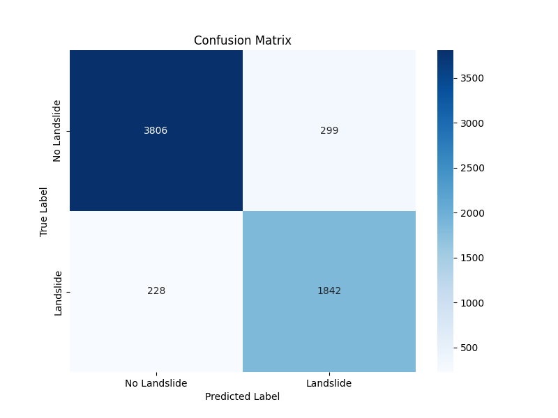
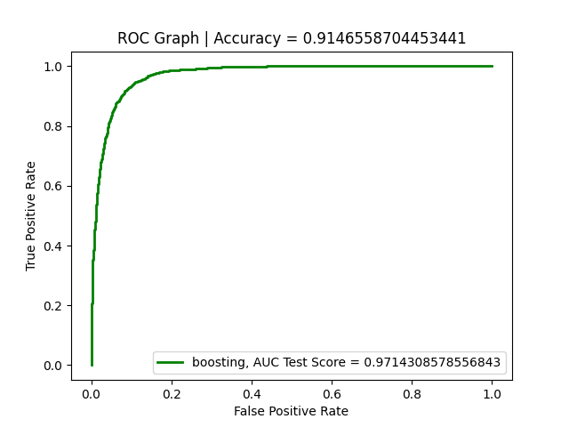

# Landslide Prediction and Monitoring
This is a fullstack ML testing and monitoring repository for a Landslide prediction task

  <table style="margin: auto;">
    <tr>
      <td></td>
      <td></td>
    </tr>
  </table>

## Environment Setup Instructions

Please install a Miniconda environment. You will find a Windows, macOS or Linux version here: https://docs.conda.io/projects/miniconda/en/latest/miniconda-install.html

- Clone this repository by using this line of code:

        git clone https://github.com/Adeniyilowee/ML-Testing-and-Monitoring.git

- Open a terminal and change directory to the git cloned repository path:

        cd ML-Testing-and-Monitoring

- Then create a new virtual environment using:

        pip install virtualenv

- Then:

        python -m venv py_env

- Activate the environment:

        source py_env/bin/activate

- Install requirement.txt using pip :

        pip --timeout=1000 install -r requirements.txt

- Finally to make all files and folder sync:

        pip install -e .
